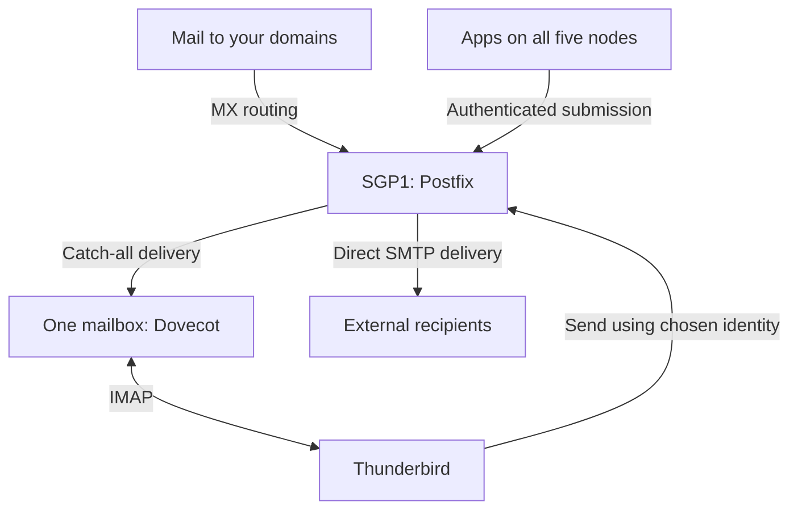

# Unified mail architecture plan

Prepared for fren on 21 September 2026; updated on 25 September after a direct `dailystonks.org` test arrived in Thunderbird. All 17 catch-alls are configured on SGP1. `yt.cafe` and seven other domains have each delivered a fresh address through their published MX to the existing `tom@whispr.dev` mailbox from LON1 over verified TLS. With the pre-existing correct `whispr.dev` record, **nine of seventeen** have the intended receiving MX configured; **eight of those nine** have a newly witnessed end-to-end test. Eight domains retain older MX routes. All five `dailystonks.org` targets returned NXDOMAIN; direct delivery to SGP1 worked, so prioritize repairing its public MX. All addresses are for fren; no paid service is wanted.

## Authoritative SSH aliases

The user explicitly confirmed these aliases. They supersede historical SSH examples and must be used in all SSH and SCP commands for this project.

| Server | SSH alias | Login command |
| --- | --- | --- |
| SGP1 | `sgp1` | `ssh sgp1` |
| LON1 | `lon1` | `ssh lon1` |
| SYD1 | `syd1` | `ssh syd1` |
| NYC1 | `nyc1` | `ssh nyc1` |

Use the existing client SSH configuration for users, ports, and keys. Service names and audit filenames do not define SSH aliases. The first copy attempt used an incorrect alias and failed during name resolution; the audit did not run.

## Recommendation

Extend the existing Postfix + Dovecot service on SGP1 to handle mail for the domains associated with SGP1, LON1, NYC1, SYD1, and PHOBOS. Keep Thunderbird as the client and retain the existing personal mailbox. Configure a catch-all for every listed domain so any valid local-part delivers into the same mailbox used by `tom@whispr.dev`. Add Thunderbird identities for addresses used when sending or replying. Verify SGP1's current configuration, connectivity, and delivery quality before applying this design.

Confirmed constraints: one human user, no new paid services, and the simplest maintainable setup. Use the existing VPSs and home resources; the resource audit must confirm adequate headroom. The design does not require a new hosting plan, a paid relay, another mail client, a webmail installation, or a management panel. Free third-party services are not dependencies of the baseline design.

A website and its email can be hosted in different places. Each domain's MX records select its receiving mail service independently of the records used for its website. Multiple addresses do not require multiple mail servers.

All addresses belong to fren; separate human accounts are unnecessary. Traffic volume is still unknown. The starting design covers ordinary correspondence, service alerts, and modest transactional mail. Any high-volume campaigns must be identified before promising that the existing delivery route and resources are sufficient.

## What is known

| Item | Evidence and status |
| --- | --- |
| Nodes | The user identifies SGP1, LON1, NYC1, SYD1, and the home node PHOBOS. |
| Existing address | The user currently accesses tom@whispr.dev through Thunderbird. |
| Ownership and budget | All addresses are for fren. No additional paid service is permitted. Simplicity and low maintenance guide implementation choices. |
| SGP1 stack | The supplied 21 September audit confirms Postfix 3.6.4 and Dovecot 2.3.16, both active, with listeners on 25, 587, and 993 over IPv4 and IPv6. Server Python is 3.10.12. |
| Certificate management | The synchronization timer was active in the SGP1 audit. Stage 2 verified TLS 1.3 and the certificate for mail.whispr.dev on public ports 587 and 993; expiry is 23 November 2026 at 21:28:24 GMT. LON1 subsequently verified the certificate on port 25 with STARTTLS. Future renewal remains unverified. |
| Hosting | The handover identifies SGP1 as a DigitalOcean droplet. The other nodes' current hosting and network policies need inventory. |
| Existing backups | The handover's verified backup was on the same server disk at that time; current off-server backup status is unknown. |
| Requested receiving policy | The user supplied 17 domains and explicitly wants catch-all delivery, matching the current `anything@whispr.dev` behavior. |
| Current receiving configuration | Stage 1 configured all 17 catch-alls, terminating at tom@localhost and the existing tom Maildir. Public-MX delivery into Thunderbird was confirmed from LON1 for `yt.cafe` and the seven added domains. `whispr.dev` already had the intended MX; eight other domains retain prior MX routes. |
| DNS ownership and access | All 17 zones were read in one Cloudflare account. The yt.cafe pilot and later seven-zone MX writes succeeded. An API token value was accidentally disclosed in chat and should be rolled if still active; no token secret is stored in this plan. |
| Original DNS snapshot | C:\Users\owner\sgp1-mail-dns-backups\20260922T184912Z-bnsqasrg contains the original read-only snapshot, preview, checks, and report. Later yt.cafe and seven-zone writes have separate backups recorded below. |
| Public mail hostname | Stage 2 found a DNS-only A record for mail.whispr.dev = 68.183.227.135. The recursive public A query agreed; no AAAA or CNAME was returned. No nameserver mismatch was reported. |
| Verified SMTP path | At 19:08 UTC on 22 September, LON1 connected to 68.183.227.135:25 in 0.162 seconds and received SMTP 220 after 0.290 seconds. Port 587 also answered. SGP1's local port-25 greeting took 0.060 seconds. |
| Windows port-25 result | The earlier timeout occurred after TCP connected and before a recorded greeting. The targeted run connected in 0.015 seconds, then was reset before a full 220 greeting. Its cause remains unknown; this is a source/path-specific observation, not proof of a general SGP1 outage or provider-wide block. |
| Postfix listener/firewall evidence | Postfix is active, listens publicly on 25 and 587, and smtp/inet invokes smtpd directly. UFW and the displayed IPv4 filter rules explicitly allow TCP 25. The nftables listing was truncated, so it is not a complete firewall audit. |
| Stage 1 recovery | Configuration backup: /root/sgp1-catchalls-backups/20260921T190930.496589Z. Postfix checks and reload succeeded; Postfix and Dovecot reported active afterward. |
| Current login model | Dovecot uses PAM passdb and passwd userdb, with mail_location = maildir:~/Maildir and ssl = required. |
| Resource snapshot | 11.2 GiB free of 33.7 GiB root disk; 2548 MiB available RAM. Adding alias routes needs no additional daemon. |
| Details not yet established | Routing and mailbox delivery for the eight legacy-MX domains, fresh independent external sending checks, the Windows-specific reset cause, exact SMTP authenticated username and backend overrides, validity/use of existing outgoing authentication records, other filtering paths, sending volumes, off-server mailbox backups, and queue condition. Public-MX delivery from LON1 is verified for eight distinct domains. |

Historical source read for this plan: `SGP1_SERVER_MAINTENANCE_HANDOVER_2026-07-23.md`, especially its backup and mail sections. Historical addresses and settings must be confirmed before use in scripts.

The newer user-supplied audit takes precedence over the historical handover wherever both address the same setting.

## Confirmed starter domain list

Source: the user's attached `email-list.txt`. There are 17 unique domain names: 16 additional domains plus the existing `whispr.dev`. These are logical delivery requirements, not a Postfix configuration block. The `*` denotes any valid local-part; it is not a DNS wildcard.

| Receiving addresses | Destination mailbox |
| --- | --- |
| `*@80days.site` | Existing mailbox used by `tom@whispr.dev` |
| `*@analoglogic.blog` | Existing mailbox used by `tom@whispr.dev` |
| `*@blairboulevard.website` | Existing mailbox used by `tom@whispr.dev` |
| `*@botforum.dev` | Existing mailbox used by `tom@whispr.dev` |
| `*@dailystonks.org` | Existing mailbox used by `tom@whispr.dev` |
| `*@fastping.it.com` | Existing mailbox used by `tom@whispr.dev` |
| `*@gongle.us` | Existing mailbox used by `tom@whispr.dev` |
| `*@litehaus.online` | Existing mailbox used by `tom@whispr.dev` |
| `*@primercrate.rs` | Existing mailbox used by `tom@whispr.dev` |
| `*@lickyour.skin` | Existing mailbox used by `tom@whispr.dev` |
| `*@showmesome.skin` | Existing mailbox used by `tom@whispr.dev` |
| `*@showmeyour.skin` | Existing mailbox used by `tom@whispr.dev` |
| `*@showsome.skin` | Existing mailbox used by `tom@whispr.dev` |
| `*@specter.in.net` | Existing mailbox used by `tom@whispr.dev` |
| `*@stealingdatais.gay` | Existing mailbox used by `tom@whispr.dev` |
| `*@whispr.dev` | Existing mailbox used by `tom@whispr.dev`; preserve current behavior |
| `*@yt.cafe` | Existing mailbox used by `tom@whispr.dev` |

Keep all spellings exactly as supplied, including the distinct `.skin` domains. The scope is these exact domains, including multi-label names such as `fastping.it.com` and `specter.in.net`. Their subdomains are not automatically included.

Catch-all receiving does not create unlimited login accounts, enable unauthenticated sending, or make arbitrary From addresses available in Thunderbird automatically. Routine reply identities can be added as needed after each sending domain is authorized and authenticated.

## Findings from the completed audit

The existing catch-all is `@whispr.dev -> tom@localhost`. There is no exact `tom@whispr.dev` entry in the virtual map. This is consistent with delivery through the catch-all into a local mailbox, because `localhost` is in `mydestination`. Stage 1 verifies the local `tom` account, existing Maildir, and relevant aliases before reusing this destination.

SMTP submission on port 587 overrides the global defaults: authentication is enabled, TLS is required, and sender ownership is checked using `hash:/etc/postfix/sender_login_maps`. The global `smtpd_sasl_auth_enable = no` does not mean submission authentication is disabled. The audit omitted SASL type/path service overrides and the sender-map contents, so these must be inspected before extending sending permission.

Dovecot reports `ssl = required`. Its separate `disable_plaintext_auth = no` setting does not by itself establish that passwords are exposed over an unencrypted public connection.

The three queried filtering/signing services are inactive, and both Postfix milter lists are empty. DKIM signing and spam filtering through those mechanisms are not configured in the shown data. Other paths, such as a content filter or local delivery processing, were not established by this audit. Review spam handling before expanding public receiving. Verify outgoing domain authentication before enabling new outbound identities; receiving-only aliases do not themselves require DKIM signing.

### Current MX results

| Domain or group | Audit result and action to plan |
| --- | --- |
| 80days.site, analoglogic.blog, blairboulevard.website, gongle.us, showsome.skin, specter.in.net, stealingdatais.gay | No explicit MX in the 22 September response. Each now has sole `MX 10 mail.whispr.dev` in its public DNS and a test message visible in the shared Thunderbird inbox on 25 September. |
| yt.cafe | Initially had no explicit MX; its new `MX 10 mail.whispr.dev` is live, and LON1 followed that public MX to an address visible in Thunderbird on 25 September. |
| botforum.dev, lickyour.skin, showmesome.skin, showmeyour.skin | Existing registrar forwarding MX records. Snapshot their settings and establish whether any historical messages remain elsewhere before switching routing. |
| dailystonks.org | Five MX entries; the priority-10 target is mx2.dialystonks.org, whose domain spelling differs from dailystonks.org. Treat this as a likely mistake to resolve during cutover, not a proven ownership claim. |
| fastping.it.com | Five priorities all name mail.fastping.it.com; these do not provide five independent destinations. |
| litehaus.online | MX 10 mail.litehaus.online. |
| primercrate.rs | The 22 September recursive result was `MX 0 _dc-mx.2faae15247e6.primercrate.rs`, while the Cloudflare API snapshot showed `MX 0 mail.primercrate.rs`. Cloudflare can synthesize `_dc-mx` targets when the underlying MX host is proxied; review its actual published answer and DNS settings before replacement. |
| whispr.dev | MX 10 mail.whispr.dev, already the intended central host. |

All 17 domains returned Cloudflare nameservers. The user has now confirmed they are all in one Cloudflare account; different nameserver pairs are consistent with that. The desired eventual receiving record for each exact domain is one MX record with priority 10 and target `mail.whispr.dev`. Replacing existing MX sets is a separate phase after server readiness and record backups. Preserve web records and unrelated DNS. Preserve any stricter existing mail policies until their effects are understood.

## Mail flow



SGP1 is the planned central service. Direct external delivery and submission from the other nodes must be verified against actual connectivity and provider policy. Do not silently introduce another service if these checks fail.

| Component | Proposed job |
| --- | --- |
| SGP1 | Run the central mail service using the existing stack. Its hosted apps also use restricted sending credentials. |
| LON1 | Host websites/apps; submit their outgoing mail to SGP1 over a permitted, encrypted, authenticated connection. |
| NYC1 | Same mail role as LON1, with credentials scoped to its applications. |
| SYD1 | Same mail role as LON1, with credentials scoped to its applications. |
| PHOBOS | Submit local application alerts; optionally receive encrypted backup copies. Live delivery must not depend on home uptime. |
| Thunderbird | Read correspondence, search across it, and send replies from the appropriate address. |

Server location is an operational label. Public email addresses should normally describe the site or purpose. Node-specific operational addresses such as `nyc1@whispr.dev` can be added if useful; none are assumed to exist.

## Addresses, accounts, and credentials

| Concept | Meaning | Proposed use |
| --- | --- | --- |
| Mailbox | Stored mail with an account/login | Retain the existing personal mailbox as the single human inbox. |
| Catch-all alias | A fallback route for valid recipient names in a configured domain | Accept arbitrary names on each of the 17 domains and deliver to the existing mailbox. No new login is created. |
| Thunderbird identity | A sending name, address, signature, and related settings | Configure each address used for replies. The server must separately authorize sending from it. |
| Application credential | Permission for an app to submit mail | One credential per app where supported, with allowed senders and rate limits. No access to the personal inbox. |

One mailbox plus domain catch-alls is the selected design. For example, `hello@gongle.us`, `support@primercrate.rs`, and `any-valid-name@yt.cafe` must reach the same mailbox without pre-creating those recipients. The catch-all policy supersedes the earlier proposal for explicit-only aliases.

First identify the working `whispr.dev` route and its final local mailbox destination. Postfix virtual aliasing is recursive, and exact address mappings take precedence over a catch-all. Preserve or establish a terminating destination: blindly adding `@whispr.dev -> tom@whispr.dev` can create a loop if that address falls back into the same rule. The audit queries the exact `tom@whispr.dev` key and each domain's catch-all key without changing them. See the [Postfix virtual-alias manual](https://manpages.debian.org/bookworm/postfix/virtual.5.en.html).

Report any existing more-specific aliases or exclusions before reconciling them with the requested all-to-one policy. Catch-alls also receive guesses, typos, and spam addressed to invented names. Retain appropriate filtering and mailbox capacity controls; avoid accepting mail that will later bounce because its final mailbox route is broken. The user has deliberately selected catch-alls, so this trade-off does not require another confirmation.

## Thunderbird and the daily workflow

Configure one IMAP account in Thunderbird and an identity for each address used for replies. Thunderbird can select a matching identity from recipient headers, but that information can be missing, especially for lists or Bcc mail. Validate reply behavior and keep the From selector visible. With all aliases delivering locally into one mailbox, its normal inbox already provides the unified view. See [Mozilla's identities documentation](https://support.mozilla.org/en-US/kb/using-identities).

Keep conversations in one visible inbox initially. Put automated server reports in a separate server-side folder so they do not bury correspondence. More per-domain filing can be added once the volume justifies it. If filing relies on the original recipient, retain trusted delivery-envelope information; visible To headers alone miss Bcc and some aliases. Verify any Sieve integration against the installed delivery path before enabling it.

Mail sent by applications does not automatically appear in Thunderbird's Sent folder. Keep searchable delivery status centrally; archive message bodies only where useful. Avoid copying every automated message into the personal inbox. Human replies and messages sent in Thunderbird should save to the intended IMAP Sent folder.

## Hosting decision and feasibility check

Selected approach: extend SGP1 and use its existing direct delivery route if verified. Centralizing the work means one mail stack to patch, one certificate-renewal path to supervise, and one mailbox to back up. Self-hosting still requires occasional attention to queues, disk space, filtering, and delivery reputation.

DigitalOcean's documentation checked for this plan says SMTP ports 25, 465, and 587 are blocked by default. This does not establish the behavior of an older working droplet; check actual connectivity and provider permission. See [DigitalOcean's SMTP policy](https://docs.digitalocean.com/support/why-is-smtp-blocked/).

Test public inbound SMTP, direct outbound SMTP, and authenticated submission from each sending node separately. If a required path fails, leave live mail routing unchanged and identify the cause. Consider another existing node only if it is suitable and explicitly permitted to carry mail. A free third-party option would need a separate check of its current limits and capabilities; none is assumed or selected. Do not evade provider restrictions or add a paid dependency.

## Requirements for the implementation

- Inventory existing DNS before changing it. Preserve unrelated records and existing legitimate sending services.
- Configure each receiving domain and its catch-all route before directing its MX records to the hub. Give the MX target working address records; do not use a CNAME as an MX target. A mail catch-all does not require wildcard DNS. Standard web/CDN proxying must not intercept mail protocols.
- Configure one valid SPF policy per sending domain, appropriate DKIM signing, and DMARC alignment. Start new DMARC enforcement cautiously after observing real traffic; do not weaken an existing working policy. Check forward/reverse DNS for direct sending and TLS on relevant paths. These measures support delivery but do not guarantee inbox placement. See [Google's sender requirements](https://support.google.com/mail/answer/81126?hl=en).
- Require encrypted, authenticated application submission. Restrict credentials to approved envelope and visible From senders; check the actual stack supports the intended enforcement. A compromised site must not gain the personal mailbox password or unrestricted cross-domain sending.
- Keep contact-form From addresses on a verified domain; put the visitor's address in Reply-To. Route replies and delivery failures somewhere monitored.
- Use durable retry handling for applications that send important messages. Inspect existing queues before installing another local mail transport.
- Use lightweight monitoring for service reachability, disk space, queue age, certificate expiry, and backup completion. Send outage notifications through an independent route.
- Identify any high-volume newsletter/campaign requirements before implementation. They may exceed the intended scope or resources; do not add an external sending service automatically.

## Implementation sequence and completion criteria

| Stage | Work | Complete when |
| --- | --- | --- |
| 1. Read-only discovery | Audit SGP1 mail configuration, authentication, aliases, certificates, queues, storage, DNS, backup status, and actual inbound/outbound connectivity; inventory other nodes' senders. Produce a redacted report. | Existing delivery and each unknown affecting the architecture are accounted for. No passwords, private keys, or mail bodies appear in the report. |
| 2. Record the domain map | Use the selected SGP1 architecture if discovery confirms feasibility. Retain the 17 supplied domains, their catch-all routes, the confirmed final mailbox destination, sending identities, app permissions, expected volumes, and DNS ownership in one inventory. | Every receiving domain has a verified terminating route; outgoing identities and permissions are defined separately. |
| 3. Protect and prepare | Back up mailbox data, configuration, required recovery secrets, DNS, and the Thunderbird profile. Retain a verified encrypted copy off-server. Prepare change and rollback procedures. | A restore has been demonstrated in an isolated location and the necessary keys are available independently. |
| 4. Pilot | Add catch-all delivery for one supplied domain. Configure sending authorization, authentication records, and one Thunderbird identity while preserving the existing mailbox and login. | A newly invented valid recipient name reaches the existing mailbox; external send, reply identity, Sent filing, and authentication are verified with user-designated test accounts. |
| 5. Expand | Add domains in small batches; provision app credentials; configure server-side filing and application retries. Change MX only after destinations are ready. | Each domain and application passes the same checks, and legacy routes remain available through the relevant DNS-cache and queue window. |
| 6. Operate | Verify backup restoration, resource headroom, alerting, and rollback. Document adding an address, revoking a credential, and restoring service. | Routine administration is repeatable and future-you has one short runbook. |

The pilot must also verify that unauthenticated external relaying and unauthorized sender identities are rejected, that valid arbitrary recipients on configured domains are delivered, that unrelated domains are not accepted for relaying, and that the original `whispr.dev` behavior still works. Check that alias rewriting terminates at the actual mailbox. Tests that send mail will use explicitly agreed accounts.

The later script package should discover before modifying; validate the inventory; protect secrets locally; show changes; back up affected configuration; apply updates safely; check syntax before reload; preserve unrelated services; and produce a result report. It should support safe reruns and an explicit rollback. Exact tools, package versions, and commands will be chosen against the live stack, rather than copied from historical configuration.

## Availability and recovery

A single self-hosted hub concentrates outages across domains. This is the main architectural trade-off. Sender retries can bridge a short outage, but their duration is finite and they are not a backup. Off-server, versioned backups and a tested restoration procedure belong in the first implementation.

Multiple MX records alone do not replicate mailboxes or create an available IMAP service. A future standby requires consistent recipients, filtering, storage/recovery design, and operational testing. Start with a recoverable central service; add redundancy if measured requirements justify it. PHOBOS can hold a backup without becoming part of the live delivery dependency.

## Completed implementation step: enable receiving on SGP1

The read-only discovery completed successfully. The user has supplied the full report. Ownership, budget, receiving policy, domain list, and SSH aliases are settled.

The deployed artifact is `sgp1-catchalls-stage1.py`, version 1.0.0. The user supplied its successful live result: all 17 receiving domains and catch-all entries were configured, Postfix checks and reload succeeded, and Postfix and Dovecot remained active. The configuration backup is `/root/sgp1-catchalls-backups/20260921T190930.496589Z`.

The script uses Linux Python 3.10+ and the existing Postfix tools; it has no pip dependencies. Without arguments it inspects and prints its proposed change. `--apply` performs the receiving change after fresh checks of the live configuration. The commands below are retained for recovery/reference; Stage 1 does not need rerunning to proceed to Stage 2.

The script adds `/etc/postfix/unified-catchalls` and its compiled hash database. Every supplied domain maps to the verified destination `tom@localhost`. It keeps the original `hash:/etc/postfix/virtual` first in the lookup chain and appends the new managed map. It updates only `virtual_alias_domains` and `virtual_alias_maps` in `main.cf`, preserving other settings. Existing aliases for the listed domains that point elsewhere cause an explicit stop rather than an overwrite. Receiving domains that overlap local, virtual-mailbox, or relay domain classes also cause a stop.

Before applying, it checks the original catch-all, local mailbox account and Maildir, relevant local aliases, service state, and the expected configuration layout. A `.forward` file, an unexpected map chain, or another delivery-path difference requires targeted review. These checks deliberately stop when the server differs from the known layout.

It backs up the affected files and their original ownership, permissions, and checksums in a private directory under `/root/sgp1-catchalls-backups/`. It builds and verifies the new map and parses the proposed configuration in a temporary staging directory before enabling the map. It then runs Postfix's configuration check, reloads Postfix, and verifies the installed settings and map. Postfix's `check` command may create missing Postfix directories; it runs only in apply/rollback mode, not in the read-only plan. See the [Postfix administrative-command manual](https://manpages.debian.org/bookworm/postfix/postfix.1.en.html).

Ordinary apply failures trigger an attempt to restore the saved configuration. The script also supports explicit rollback and refuses to overwrite files that have changed independently since its transaction. Abrupt power loss or an uncatchable process termination cannot be promised automatic recovery; the printed backup directory and saved transaction record support explicit recovery. Repeating a successful apply validates the existing state and performs no changes.

This step does not modify DNS, Dovecot, credentials, certificates, SMTP sender authorization, or existing mail contents. It does not send test messages. Its backups cover this configuration change and are on the same server; they do not replace an off-server mailbox backup.

### Stage 1 commands retained for reference

Save `sgp1-catchalls-stage1.py` in Downloads, then run:

```powershell
& {
    $mailSetupPath = Join-Path $env:USERPROFILE 'Downloads\sgp1-catchalls-stage1.py'
    if (-not (Test-Path -LiteralPath $mailSetupPath -PathType Leaf)) {
        throw 'Save sgp1-catchalls-stage1.py in Downloads first.'
    }

    scp $mailSetupPath 'sgp1:sgp1-catchalls-stage1.py'
    if ($LASTEXITCODE -ne 0) { throw 'Copy failed; setup was not run.' }

    ssh -t sgp1 'sudo python3 "$HOME/sgp1-catchalls-stage1.py" --apply'
    if ($LASTEXITCODE -ne 0) { throw 'Setup stopped; paste the complete output for review.' }
}
```

The script prints its backup path and a final result. The user has supplied `STAGE 1 COMPLETE`. This means Postfix receiving configuration is prepared; it does not prove that public email for every domain reaches SGP1.

For a read-only preview after the file has been copied:

```powershell
ssh -t sgp1 'sudo python3 "$HOME/sgp1-catchalls-stage1.py"'
```

If the completed stage-1 change needs reverting, this command uses its exact recorded backup and restores only if the affected files have not drifted:

```powershell
ssh -t sgp1 'sudo python3 "$HOME/sgp1-catchalls-stage1.py" --rollback /root/sgp1-catchalls-backups/20260921T190930.496589Z'
```

Use the exact backup path printed by an interrupted transaction when recovering that transaction; `latest` refers to the latest successful apply. Rollback does not alter mail already received or reverse DNS changes performed separately.

### Validation evidence

Version 1.0.0 passed Python 3.10 syntax parsing and ten offline tests: exact domain preservation, multiline configuration editing, a read-only plan, successful apply and safe repeat, exact restoration by rollback, restoration after an injected apply failure, refusal of rollback after unrelated edits, conflicting alias protection, concurrent-edit detection, and symlink rejection. The tests use a temporary filesystem and simulated Postfix commands. The user's successful execution report now also confirms the script's live configuration checks, reload, map installation, and service-state checks on SGP1.

The earlier audit script also passed nine offline checks before the user successfully ran it on SGP1. Its output remains an inspection snapshot, not a proof of external sending or receiving.

### Work following successful stage 1

1. Verify incoming SMTP from outside SGP1 and the mailbox delivery path, using agreed test messages; verify the central hostname's address records and TLS presentation.
2. Use the confirmed single Cloudflare account to capture all API-visible DNS records in the 17 zones and preview exact apex MX replacements. The Stage 2 tool below performs this work on the user's Windows PC. Any API token stays local and scoped to the intended zones; do not paste it into chat.
3. Confirm existing filtering and set up suitable spam filtering and DKIM signing within current resources. Inspect existing SPF and DMARC policies and preserve legitimate senders and stricter working policies.
4. Pilot one domain's MX cutover to `mail.whispr.dev`, verify random-recipient catch-all delivery, then migrate the other domains in batches. Check whether the old mail destinations contain historical messages that need preserving.
5. Extend sender authorization using the actual SMTP login identity, configure Thunderbird identities, and verify authentication and reply behavior. Give applications separately restricted submission credentials.
6. Complete off-server mailbox backups, restoration checks, and lightweight independent monitoring.

Stage 1 is deployed successfully. Stage 2 completed successfully on Windows. The targeted diagnostic subsequently verified TCP and the SMTP greeting from LON1 to SGP1 on public port 25. The next input is the single-message delivery test and confirmation that it appears in Thunderbird.

## Completed implementation step: Cloudflare backup and DNS preview

Artifact: `sgp1-cloudflare-stage2.py`, version 1.0.0. Run it locally in Windows PowerShell with Python 3.10 or newer. It uses only Python's standard library. It does not use SSH, install packages, change DNS, send mail, or authenticate to the mailbox. There is no apply mode in this artifact.

The tool reads each exact Cloudflare zone, following pagination, and saves all API-visible DNS records. It does not guess parent zones for `fastping.it.com` or `specter.in.net`. Missing access produces an incomplete result, preserving successful captures. It checks account consistency and previews only MX records at the 17 requested domain names. A single existing `MX 10 mail.whispr.dev` is kept with its original TTL and metadata; proposed new/replacement MX records use TTL 300. Subdomain MX, website records, TXT policies, and other DNS data are preserved in the snapshot and are not part of the proposed mutation.

The tool checks whether `mail.whispr.dev` has the expected DNS-only A record for `68.183.227.135`, detects CNAME/proxy issues, and compares public recursive nameserver answers with the captured zone's assigned nameservers. Public queries use Cloudflare's DNS-over-HTTPS JSON service, with DNSSEC checking left enabled. These observations can be cached and are not direct authoritative queries.

SMTP checks connect from the Windows PC to the known IPv4 and up to four published IPv6 addresses on ports 25 and 587, read the greeting, issue EHLO and STARTTLS, and validate the certificate for `mail.whispr.dev`. IMAPS on port 993 is checked similarly with TLS before its greeting. No MAIL, RCPT, DATA, AUTH, or mailbox login is sent. A failed connection may be due to the client, ISP, network path, or SGP1; it is not proof of a server outage. No such probe proves message delivery or outgoing reputation.

Existing MTA-STS markers, TLSA records, null MX, managed MX metadata, apex CNAME records, and multiple SPF policies produce review findings. Counts of SPF, DMARC, and DKIM records are an inventory, not authentication validation. Existing policies, including their full values, remain in the private local snapshot for later targeted review.

### Cloudflare token

In [Cloudflare API Tokens](https://dash.cloudflare.com/profile/api-tokens), create a custom user token named `SGP1 mail DNS preview` with these permissions:

| Scope | Permission | Access |
| --- | --- | --- |
| Zone | Zone | Read |
| Zone | DNS | Read |

Set Zone Resources to include the 17 specified zones. A token that already has DNS Edit plus Zone Read for those zones also works, but write access is unnecessary for this step. Store the secret securely, then enter it only at the script's hidden local prompt. The program refuses an echoing prompt and HTTP redirects, sends the token only to Cloudflare's API, and never writes it to backups, the report, command-line arguments, or environment variables. See [Cloudflare token creation](https://developers.cloudflare.com/fundamentals/api/get-started/create-token/), [zone listing](https://developers.cloudflare.com/api/resources/zones/methods/list/), and [DNS record listing](https://developers.cloudflare.com/api/resources/dns/subresources/records/methods/list/).

### Stage 2 command retained for reference

Save the complete file in Downloads, then paste this in PowerShell:

```powershell
& {
    $mailDnsPath = Join-Path $env:USERPROFILE 'Downloads\sgp1-cloudflare-stage2.py'
    if (-not (Test-Path -LiteralPath $mailDnsPath -PathType Leaf)) {
        throw 'Save sgp1-cloudflare-stage2.py in Downloads first.'
    }
    python $mailDnsPath
    if ($LASTEXITCODE -ne 0) {
        throw 'Preview incomplete; paste the complete terminal output for review.'
    }
}
```

The default output location is a unique timestamped folder below `C:\Users\owner\sgp1-mail-dns-backups` (derived from the user's actual profile, not hardcoded). The tool prints the exact folder.

| File | Purpose |
| --- | --- |
| `snapshot.json` | Full DNS record backup for captured zones, including record IDs, TTLs, TXT data, comments, and capture times. Private; keep locally. This does not export all Cloudflare account settings. |
| `mx-plan.json` | Review-only proposed MX sets, previous MX data, findings, and the snapshot's SHA-256. Not executable as an apply/restore program. |
| `checks.json` | Public DNS observations and SMTP/IMAPS results, with unsuccessful checks explicitly marked. |
| `report.txt` | Human-readable report to share in chat. Omits the token, account/zone IDs, unrelated DNS contents, and raw API error bodies. |

Each completed zone is checkpointed. The account-wide capture is not atomic, and a later cutover must reread affected live records to detect drift. The tool creates a fresh folder on every run. `--skip-network` is available for DNS backup only and explicitly marks public reachability as unknown. Exit 0 means the DNS capture completed; it is not a readiness or delivery verdict. Exit 2 indicates a failed/incomplete capture or local operation; exit 130 indicates interruption.

### Stage 2 validation and next move

The complete script passed Python 3.10 syntax parsing and 15 offline tests using temporary files and simulated API/socket responses. They cover exact domain spellings, preservation of an already-correct MX and its metadata, apex-only scope, null MX and existing policy findings, pagination completeness and duplicate detection, rejection of mismatched zones/records, GET-only requests, token separation from public DNS requests, redirect rejection, error-body redaction, refusal of an echoing credential prompt, full and partial backup/report persistence, SMTP STARTTLS command sequence without mail/authentication commands, correct TLS hostname selection, TLS failure reporting, IMAPS without login, and refusal to probe private addresses.

The user has now supplied the successful live Windows execution report, completing the DNS backup and preview. It captured all 17 zones in one account and produced eight ADD MX proposals, eight REPLACE MX SET proposals, and one KEEP for whispr.dev. No changes were applied. The raw Cloudflare MX for primercrate.rs was `0 mail.primercrate.rs`, while the older recursive audit had returned a generated `_dc-mx...` hostname; retain both observations with their sources rather than assuming a broken record.

Existing SPF was found for nine domains; DMARC for primercrate.rs and whispr.dev; DKIM record names for fastping.it.com, primercrate.rs, and whispr.dev. These are presence counts only. Existing selectors or policies do not prove active signing, aligned sending, or an enabled DKIM service. Preserve their values before planning changes.

Public ports 587 and 993 passed TLS 1.3 certificate verification for mail.whispr.dev. Port 25 timed out during Stage 2; the follow-up diagnostic below subsequently verified its greeting from LON1. No messages were sent by these discovery tools. Verify actual catch-all mailbox delivery before the one-domain MX pilot, and address spam handling before broad expansion. Sending identities and authentication configuration remain separate work.

## Completed diagnostic: SMTP port-25 path

Artifact: `sgp1-port25-check.py`, version 1.0.0. Python 3.10+, standard library only. This is a read-only diagnostic, not a firewall repair or DNS cutover script. It uses the correct SSH aliases `sgp1` and `lon1` in the supplied run block.

The earlier Stage 2 report combined connection and response timeouts in one message. Its local `checks.json` still records whether TCP connected and whether a 220 greeting was observed. The new tool first reports those selected flags, then runs fresh checks that distinguish TCP connection from the full SMTP greeting. It allows eight seconds to connect and forty seconds for the entire greeting, including multiline pre-greetings. A delayed SMTP greeting can have an anti-spam explanation; do not label it an IP block from a timeout alone. See [Postfix postscreen_greet_wait](https://manpages.debian.org/bookworm/postfix/postconf.5.en.html#postscreen_greet_wait).

The Windows run probes the known public IPv4 on 25 and 587. The SGP1 run verifies Postfix's hostname, inspects its local listeners and selected SMTP/filters settings, reads available UFW/IPv4 iptables/nftables rules, and probes 127.0.0.1 on 25 and 587. The LON1 run probes SGP1's public IPv4 from another node. Loopback success does not establish external reachability. Firewall listings are bounded; truncated or missing data is explicitly marked and is not a firewall verdict. Cloud-provider firewall settings and network restrictions cannot be inspected from these host commands.

DigitalOcean documents default SMTP restrictions on Droplets. A failed LON1 probe could therefore originate at LON1's provider path rather than SGP1. Do not conclude that SGP1 blocks public mail merely because Windows and another Droplet both time out. Use an actual external message and, if needed, narrowly targeted packet observation or provider firewall inspection to resolve what remains. See [DigitalOcean's SMTP documentation](https://docs.digitalocean.com/support/why-is-smtp-blocked/).

The diagnostic sends only QUIT after a complete 220 greeting. It performs no message delivery, EHLO, AUTH, mailbox login or TLS negotiation. TLS 587/993 already passed Stage 2, so this step focuses on the unverified connection/greeting path. It installs no packages and changes no firewall rules, mail settings or DNS. The wrapper copies this new diagnostic file into the login home on SGP1 and LON1; these copies are the only remote files it writes.

### Run the targeted diagnostic from Windows PowerShell

Save `sgp1-port25-check.py` in Downloads, then paste the complete block below. The SGP1 step uses sudo for firewall inspection. No Cloudflare token is needed.

```powershell
& {
    $smtpCheckPath = Join-Path $env:USERPROFILE 'Downloads\sgp1-port25-check.py'
    if (-not (Test-Path -LiteralPath $smtpCheckPath -PathType Leaf)) {
        throw 'Save sgp1-port25-check.py in Downloads first.'
    }
    $previousMailChecks = Join-Path $env:USERPROFILE 'sgp1-mail-dns-backups\20260922T184912Z-bnsqasrg\checks.json'

    python $smtpCheckPath --label WINDOWS --previous-checks $previousMailChecks
    if ($LASTEXITCODE -ne 0) { throw 'Windows diagnostic did not complete; paste its output.' }

    foreach ($smtpNode in @('sgp1', 'lon1')) {
        scp $smtpCheckPath "${smtpNode}:sgp1-port25-check.py"
        if ($LASTEXITCODE -ne 0) { throw "Copy to $smtpNode failed; remote checks stopped." }
    }

    ssh -t sgp1 'sudo python3 "$HOME/sgp1-port25-check.py" --server'
    if ($LASTEXITCODE -ne 0) { throw 'SGP1 inspection did not complete; paste its output.' }

    ssh lon1 'python3 "$HOME/sgp1-port25-check.py" --label LON1'
    if ($LASTEXITCODE -ne 0) { throw 'LON1 diagnostic did not complete; paste its output.' }
}
```

Exit 0 means the diagnostic finished, including any failed network probes; assess its reported TCP and SMTP results. Exit 2 means invalid invocation or SGP1 inspection could not run. A missing earlier checks.json is reported and does not prevent fresh probes. The script prints to the terminal and does not create more backup/report folders. Share the complete output for targeted interpretation.

### Validation and follow-through

The script passed Python 3.10 syntax parsing and nine offline tests: fragmented/multiline/minimal SMTP greetings; separate TCP and greeting timeout reporting; QUIT-only success behavior; rejection and malformed reply handling; a whole-greeting deadline that partial bytes cannot reset; selective reading of the earlier check without unrelated data; rejection of a mismatched SGP1 identity; read-only server inspection commands, inactive service reporting and comment redaction. Tests used simulated sockets, commands and temporary files. They do not establish live network behavior.

The user supplied the complete live output in `Pasted text(20260922-190842).txt`. This file was read from its supplied attachment path and was not modified. The relevant results are:

| Source and target | TCP connection | Complete SMTP greeting |
| --- | --- | --- |
| Windows -> SGP1 public IPv4:25 | Connected in 0.015 s | Connection reset before full greeting |
| Windows -> SGP1 public IPv4:587 | Connected in 0.015 s | 220 after 1.258 s |
| SGP1 -> 127.0.0.1:25 | Connected in 0.003 s | 220 after 0.060 s |
| SGP1 -> 127.0.0.1:587 | Connected in 0.001 s | 220 after 0.001 s |
| LON1 -> SGP1 public IPv4:25 | Connected in 0.162 s | 220 after 0.290 s |
| LON1 -> SGP1 public IPv4:587 | Connected in 0.168 s | 220 after 0.283 s |

The inspected smtp service runs smtpd directly, not postscreen; the displayed postscreen_greet_wait default is not evidence that postscreen caused the Windows failure. Main client restrictions and upstream-proxy protocol settings are empty, with no selected service overrides. The reported content_filter, smtpd_proxy_filter, smtpd_milters and non_smtpd_milters settings are empty. Other checks/local/client filtering still require separate review.

UFW is active and explicitly allows 25/tcp. The displayed IPv4 iptables filter table contains the corresponding accept rule. The nftables output was truncated at 180 of 519 lines, which prevents treating it as a complete inventory. Independent of that limitation, the LON1 result positively demonstrates a functioning connection and SMTP greeting on this public target from that source. No blanket firewall opening, service restart or attempt to bypass a provider restriction is supported or needed by this evidence.

The Windows result may involve software, filtering or an intermediary on that path, including source-dependent behavior at either end. Its precise cause has not been identified. Keep it separate from the SMTP path that is now positively verified from LON1. The intended Thunderbird submission/IMAP paths remain ports 587 and 993, already checked with TLS.

The next step is actual mailbox delivery using LON1 as a test sender. An additional message from an existing independent mail provider will be useful after the MX pilot to verify ordinary public MX routing; LON1's direct test below deliberately bypasses the recipient domain's current MX. No external message has yet been sent by the assistant. The first receiving-only pilot remains yt.cafe. Adding its MX changes routing even though it currently has no explicit MX, because address-record fallback can exist.

## Completed implementation step: one real catch-all delivery test

Artifact: `sgp1-catchall-test.py`, version 1.0.0. Python 3.10+, standard library only. With no arguments it prints a preview and makes no network connection. With `--send`, it attempts exactly one actual email to a fresh generated address of the form `setup-check-YYYYMMDD-<random-id>@yt.cafe`. This address is not created as an explicit alias; it exercises the already-installed catch-all.

Run the sender on LON1, targeting mail.whispr.dev on port 25. The script verifies the connected IPv4 matches 68.183.227.135, refuses an apparent SGP1 self-test, uses the source socket's address literal for EHLO, requires STARTTLS with a valid certificate for mail.whispr.dev, then submits one recipient and one message. It uses no mailbox password or SMTP AUTH, because public SMTP delivery to a configured receiving domain is the behavior under test. The SMTP client APIs and TLS sequencing are documented in [Python's smtplib reference](https://docs.python.org/3/library/smtplib.html).

The visible From is `Mail setup check <postmaster@yt.cafe>`. The envelope sender is null to prevent a failure-mail loop; the message is marked Auto-Submitted: auto-generated. It contains a unique Message-ID and test ID for tracing. This controlled diagnostic is not a claim that production sending identities, sender authentication or reputation are configured.

The sole intended message should be delivered through the yt.cafe catch-all to the mailbox already accessed as tom@whispr.dev. Its subject starts with `[SGP1 test] yt.cafe`. The test does not change DNS, install software, restart services, modify configuration or flush a queue. Only the expected test message and ordinary server logs may be added. The wrapper copies the diagnostic file into the LON1 login home.

### Execute the delivery test

Save `sgp1-catchall-test.py` in Downloads, then run this complete block in Windows PowerShell. This action sends one test email. It needs neither sudo nor a Cloudflare token.

```powershell
& {
    $catchallTestPath = Join-Path $env:USERPROFILE 'Downloads\sgp1-catchall-test.py'
    if (-not (Test-Path -LiteralPath $catchallTestPath -PathType Leaf)) {
        throw 'Save sgp1-catchall-test.py in Downloads first.'
    }

    scp $catchallTestPath 'lon1:sgp1-catchall-test.py'
    if ($LASTEXITCODE -ne 0) { throw 'Copy failed; no test email was attempted.' }

    ssh lon1 'python3 "$HOME/sgp1-catchall-test.py" --send'
    if ($LASTEXITCODE -ne 0) {
        throw 'Test did not report confirmed acceptance; paste the output before retrying.'
    }
}
```

The terminal prints the exact recipient, subject, Message-ID and test ID. `SMTP ACCEPTED` means the server returned 250 after message DATA; it does not by itself establish final mailbox delivery. Check the existing tom@whispr.dev account in Thunderbird, first the Inbox and then Junk if needed, for the printed subject. Seeing that message confirms the tested route reaches the existing client-visible mailbox.

If the final SMTP response is lost after DATA begins, the tool reports DELIVERY OUTCOME UNKNOWN and never automatically retries. Check for the printed test ID before rerunning to avoid an unnecessary duplicate. A later QUIT failure does not erase a known successful 250 acceptance. Exit 0 means preview/SMTP acceptance, 2 means failure or rejection, 3 means uncertain delivery outcome, and 130 means interruption.

### Validation and next action

Ten offline checks passed: Python 3.10 syntax and MIME/header round-trip; preview without networking; one recipient/one DATA only after certificate-verifying TLS; standard null-reverse-path encoding; refusal to send after TLS failure or recipient rejection; uncertain outcome without retry after a lost DATA response; retention of known acceptance after QUIT disconnect; rejection of a wrong target or SGP1 self-test; and rejection of additional recipients. Tests used simulated SMTP sessions; no email was sent during development.

The user ran the test from LON1 on 22 September. The SMTP peer at `68.183.227.135:25` returned a 220 greeting, the client verified the STARTTLS certificate for `mail.whispr.dev`, the new recipient `setup-check-20260922-cb161f61b4fd436699c058498fd7297b@yt.cafe` was accepted, and Postfix returned `2.0.0 Ok: queued as F1847F6C` after DATA. The user then pasted the message body displayed in the existing `tom@whispr.dev` mailbox. This confirms the tested alias routes into the existing mailbox, but says nothing yet about public `yt.cafe` MX lookup. The next step is the one-domain MX pilot below.

## Completed receiving-DNS step: `yt.cafe` public MX pilot

Artifact: `sgp1-yt-cafe-mx-pilot.py`, version 1.0.2. Run locally on Windows with Python 3.10+ and the standard library; no SSH connection is used. `yt.cafe` had no explicit apex MX in the previous Cloudflare API snapshot, and the tested target is `mail.whispr.dev` at `68.183.227.135`. This change is receiving-only. It does not add authenticated sending identities, SPF, DKIM, or DMARC.

The first Windows attempt at 06:23 BST on 25 September stopped with `PermissionError` immediately after `Mode: APPLY`, before a backup path or hidden token prompt. This establishes that no Cloudflare request or DNS change occurred. The exact Windows operation denied was not exposed by version 1.0.0; its startup opened a lock file inside the old backup directory. Version 1.0.1 moves that lock to the local temporary directory, checks that the existing backup root can accept a real write before requesting credentials, and uses a private `AppData\Local\sgp1-mail-dns-backups` folder if the original root is blocked. It prints the chosen backup root. If both roots are blocked, it stops with the failing OS codes before contacting Cloudflare. `--local-check` exercises this local startup path without requesting a token or touching the network. Do not infer that the reported PermissionError identified a particular antivirus policy or ownership problem; no Windows filesystem inspection has yet been performed.

`--apply` captures every API-visible DNS record in **only** the `yt.cafe` zone into a new private local folder under the Windows profile `sgp1-mail-dns-backups`, or the printed private fallback folder if necessary. It checks for the exact Cloudflare account/zone, active full-zone status, no unexpected existing apex MX, no apex CNAME or MTA-STS marker, delegated nameservers, and the tested mail host's public A address without AAAA/CNAME. It rereads the full zone immediately before writing and refuses drift. It then adds exactly one DNS record: `MX yt.cafe 10 mail.whispr.dev`, TTL 300 seconds, with a unique private tracking comment. It reads again to verify one intended MX. A previously installed equivalent MX is left unchanged, including its TTL/comment, with no rollback ownership claimed. An unexpected MX blocks the pilot; the script does not replace other providers' MX records.

The script journals before POST or DELETE and never blindly retries a write after an interrupted response. Its printed `--status FOLDER` command rereads the live record and reconciles the transaction with its unique comment and ID. `--rollback FOLDER` deletes only its own unchanged MX after a second pre-deletion read; it stops if the MX set or owned record changed. If a delete response was lost, status can verify absence without repeating the deletion. The snapshot is a DNS-record backup, not an export of all Cloudflare zone settings or a complete restore utility. No token is saved; do not share `transaction.json` because it contains private DNS records and comments. As with any public DNS edit, another administrator could race between the final read and write; keep mail-DNS edits single-threaded while running this pilot.

Cloudflare's [DNS record creation endpoint](https://developers.cloudflare.com/api/resources/dns/subresources/records/methods/create/) and [deletion endpoint](https://developers.cloudflare.com/api/resources/dns/subresources/records/methods/delete/) require `DNS Write`. Before applying, edit the existing Cloudflare API token under **My Profile → API Tokens** so **Zone → DNS → Edit** is enabled; keep **Zone → Zone → Read** and the existing zone scope. [Cloudflare documents editing token permissions after creation](https://developers.cloudflare.com/fundamentals/api/get-started/create-token/). The token is prompted without echo and sent to Cloudflare's API only. An old read-only token can still run the script's preview mode, but cannot apply or roll back.

The user ran version 1.0.1 on 25 September at 06:35 BST. Local check succeeded using the fallback backup folder under `C:\Users\owner\AppData\Local\sgp1-mail-dns-backups`; the original backup folder remained unwritable. The script saved three initial `yt.cafe` DNS records to `pilot-yt-cafe-20260925T053502Z-7d9b0dc3c3`, confirmed public delegated nameservers and the mail host's A record, then printed `Creating the single yt.cafe MX record...`. It subsequently printed `Incomplete API listing`. In this code the error occurs **after** a successful Cloudflare create response with a valid record ID, which is written to `transaction.json` in phase `created`; the follow-up list check used a strict `total_count` comparison. The Cloudflare token used for this operation provided the necessary access; the user does not need to choose a different token or create an account token to diagnose this attempt. Do not request or share the token or full journal.

Version 1.0.2 ends a paginated list on a short final page and still rejects malformed pages and duplicate record IDs. It no longer treats a transient or unfiltered `total_count` as proof that the returned page is incomplete; see [Cloudflare's record-list API](https://developers.cloudflare.com/api/resources/dns/subresources/records/methods/list/). A read-only status of a previously created record now refuses to infer deletion from a single listing where its saved ID is absent. No automatic duplicate POST, DNS edit, or rollback should be attempted on the old journal. A token-backed `--status FOLDER` remains available with the corrected script if a later rollback needs it. The user completed the token-free journal and public DNS check below.

Completed **read-only** block from Windows PowerShell. It printed only the journal phase, whether the create response saved an ID, and public MX answers from both assigned authoritative Cloudflare nameservers and Cloudflare's recursive resolver. It did not print the private journal or prompt for a token.

```powershell
& {
    $pilotFolder = Join-Path $env:LOCALAPPDATA 'sgp1-mail-dns-backups\pilot-yt-cafe-20260925T053502Z-7d9b0dc3c3'
    $journalPath = Join-Path $pilotFolder 'transaction.json'
    if (-not (Test-Path -LiteralPath $journalPath -PathType Leaf)) {
        throw 'The pilot journal is missing; do not retry or roll back.'
    }
    $journal = Get-Content -LiteralPath $journalPath -Raw | ConvertFrom-Json
    if ($journal.domain -ne 'yt.cafe') { throw 'Unexpected journal domain.' }
    'Journal phase: ' + $journal.phase
    'Cloudflare record ID saved: ' + [bool]$journal.created_id
    foreach ($server in @('cris.ns.cloudflare.com', 'ruth.ns.cloudflare.com', '1.1.1.1')) {
        try {
            $mx = @(Resolve-DnsName -Name 'yt.cafe' -Type MX -Server $server -DnsOnly -ErrorAction Stop | Where-Object { $_.Type -eq 'MX' })
            if ($mx.Count -eq 0) { "${server}: no MX in answer" }
            foreach ($record in $mx) {
                '{0}: MX {1} {2}' -f $server, $record.Preference, $record.NameExchange
            }
        } catch {
            '{0}: MX lookup failed: {1}' -f $server, $_.Exception.Message
        }
    }
}
```

At 06:48 BST on 25 September the user reported: journal `created`; record ID saved `True`; `cris.ns.cloudflare.com`, `ruth.ns.cloudflare.com`, and `1.1.1.1` each returned `MX 10 mail.whispr.dev`. Thus the receiving MX itself is publicly visible and there is no reason to rerun the Cloudflare create or sort through tokens. Verify one email sent through that MX to the existing Thunderbird inbox, then review the remaining seven domains without explicit MX and eight domains whose existing MX sets would be replaced. Preserve `whispr.dev`'s already-correct MX. Sending identities, authentication and spam controls remain separate stages.

Original offline validation: Python 3.10 syntax parsing and 15 behavior tests passed. They cover backed-up one-record creation, preview, preservation of a pre-existing correct MX, unexpected MX/CNAME/MTA-STS rejection, drift before writing, an ambiguous POST response recovered by unique marker, safe rerun, owned-record rollback and second rollback, refusal to delete edited records or conflicting MX, ambiguous DELETE recovery, unknown POST outcome without invented success, endpoint scoping, pagination validation, transaction identity checking, and hidden-prompt fallback refusal. An additional isolated HTTP check verified token separation from public DNS, redirect refusal, redacted error responses, and no automatic write retry. The live create succeeded. Its follow-up API list check in version 1.0.1 failed, but authoritative DNS, a public resolver, and the subsequent public-MX mail test confirmed the record and delivery.

Version 1.0.1 passed seven additional focused checks: Python 3.10 syntax and local-only mode with no Cloudflare client or token; simulated original backup-root denial with private fallback; both backup roots denied before token/network; lock independent of the backup folder; still exactly one created and owned record with rollback; lost POST reply recovery; and refusal to roll back an edited record. These simulations validate the new control flow, but the reported Windows permission denial can only be localized by running version 1.0.1 there. Its local-only check will report whether the revised startup is writable before the DNS step.

Version 1.0.2 passed ten focused checks including the local startup tests, a returned record page with a stale count after creation, a second page with changed count and duplicate-ID rejection, and refusal to claim that an ID recorded from a successful create is absent based solely on one incomplete API listing. No live Cloudflare operations were run while creating this revision. Replace the old Downloads copy before any future token-backed `--status` or `--rollback`; no user-run DNS action is needed for the next read-only check above.

## Completed implementation step: one public-MX delivery test

Artifact: `sgp1-mx-route-test.py`, version 1.0.0; Python 3.10+, standard library only. Run it from LON1. By default it prints a preview without network or sending. With `--send`, it queries Cloudflare's public DNS-over-HTTPS resolver for `yt.cafe` MX and refuses to send unless the answer is exactly one `MX 10 mail.whispr.dev`. It then connects to the selected host on port 25, checks that the peer is the already-tested `68.183.227.135` from a non-SGP1 source, requires STARTTLS with a valid certificate for the MX hostname, and submits a single fresh `setup-check-YYYYMMDD-<random-id>@yt.cafe` test message. It uses a null envelope sender, no passwords, and no SMTP AUTH. It does not change DNS or configuration; it does not blindly retry an ambiguous DATA response. The subject starts with `[SGP1 MX test] yt.cafe`. The test is from LON1, so it is a controlled public-MX path, not a survey of every sender on the internet. Cloudflare documents the [DoH JSON endpoint](https://developers.cloudflare.com/1.1.1.1/encryption/dns-over-https/make-api-requests/dns-json/) and Python documents [SMTP STARTTLS](https://docs.python.org/3.10/library/smtplib.html).

Download `sgp1-mx-route-test.py` to `C:\Users\owner\Downloads` and run this complete Windows PowerShell block. It copies only the test script to LON1 using the correct `lon1` SSH alias. The `--send` run sends one message if DNS, peer address and TLS checks all pass; check the existing `tom@whispr.dev` account in Thunderbird for the printed subject before any retry.

```powershell
& {
    $mxTestPath = Join-Path $env:USERPROFILE 'Downloads\sgp1-mx-route-test.py'
    if (-not (Test-Path -LiteralPath $mxTestPath -PathType Leaf)) {
        throw 'Save sgp1-mx-route-test.py in Downloads first.'
    }

    scp $mxTestPath 'lon1:sgp1-mx-route-test.py'
    if ($LASTEXITCODE -ne 0) { throw 'Copy failed; no test email was attempted.' }

    ssh lon1 'python3 "$HOME/sgp1-mx-route-test.py" --send'
    if ($LASTEXITCODE -ne 0) {
        throw 'Test did not report confirmed SMTP acceptance; paste the output before retrying.'
    }
}
```

Seven focused offline checks passed for the test script: Python 3.10 syntax; preview with no network; exact one-record DoH MX acceptance and rejection of wrong/duplicate/absent/failed responses; no SMTP connection if MX differs; one message after verified TLS and expected peer; refusal to send DATA after a wrong peer or TLS failure; and unknown result without automatic retry if DATA response is lost. These used simulated DNS and SMTP responses; no real test email was sent during development.

On 25 September fren read the delivered message in the existing Thunderbird mailbox, addressed to `setup-check-20260925-112b6c2251e9482e8f9d4675aba8659b@yt.cafe`. The LON1 script looked up `yt.cafe`'s public MX, connected to `mail.whispr.dev` on SGP1 with verified TLS, and sent that message. Seeing it in the shared mailbox confirms this controlled public-MX route works end to end. No further yt.cafe pilot or Cloudflare-token troubleshooting is needed for that receiving path.

## Completed implementation step: add the other seven zones without explicit MX

Artifact: `sgp1-seven-mx-add.py` version 1.0.2. Scope is exactly `80days.site`, `analoglogic.blog`, `blairboulevard.website`, `gongle.us`, `showsome.skin`, `specter.in.net`, and `stealingdatais.gay`. This is a local Windows Python 3.10+ standard-library tool; it requires no SSH, server login, package installation, or mail-client change. It changes only the receiving MX for these seven exact zones; `yt.cafe` and `whispr.dev` are already routed. The eight domains with existing MX records are deliberately excluded until their present mail routes are reviewed.

The script first checks whether its token can list all seven exact Cloudflare zones and names any missing zones before reading DNS records. Only after all seven are visible does it read their complete DNS records, verify they are active and in the same account, check nameserver delegation and the tested mail host's public IPv4-only address, and save a full private snapshot and write journal on the local PC. It will use `C:\Users\owner\AppData\Local\sgp1-mail-dns-backups` automatically if the original home backup directory is unwritable. Before its first write it rereads all seven zones to catch drift; it checks again just before each change. For an unchanged zone with no MX it adds one `MX 10 mail.whispr.dev` with TTL 300 and a unique tracking comment; it leaves an already-correct existing MX intact. Any unexpected MX, apex CNAME, MTA-STS marker, inaccessible zone, DNS drift, or conflicting record stops the batch. Changes are sequential: if a later zone fails, earlier successful additions remain. The printed `--status FOLDER` inspects the journal and live DNS before another action; `--rollback FOLDER` removes only unchanged records with a saved ID that this transaction created. An uncertain write is never repeated or rolled back blindly. The snapshot includes private DNS TXT records, so share terminal output only, not `transaction.json`.

**Credential correction, 25 September:** One Cloudflare user API token value was accidentally sent in the conversation after preparing this script. The secret is intentionally not recorded here. Treat that token as exposed: in Cloudflare My Profile > API Tokens, find the corresponding entry, open its three-dot menu, and choose Roll, then Confirm. Cloudflare says rolling invalidates the previous value and keeps its existing permissions. If Roll is unavailable, delete that same entry and create a replacement. If the entry is ambiguous among several tokens, identify it before changing another token by mistake. Do not run the seven-zone script using the exposed value or send any replacement value in chat. Removing a chat message does not replace revocation. Official instructions: [Roll tokens](https://developers.cloudflare.com/fundamentals/api/how-to/roll-token/) and [Create API token](https://developers.cloudflare.com/fundamentals/api/get-started/create-token/).

At 07:53 BST on 25 September the user ran version 1.0.0 with `--apply`. Windows printed a writable backup **root** under AppData, then `STOPPED: 80days.site: expected one accessible exact Cloudflare zone.` No transaction folder or `Backup:` command was printed; the script failed on its first Cloudflare zone lookup before DNS reading, backup, or any write. There is no status or rollback command to run for this failed attempt. This response alone cannot prove whether the entered token lacked `Zone > Zone > Read`, excluded `80days.site` from Zone resources, or both. Cloudflare's [Edit Zone DNS token template](https://developers.cloudflare.com/fundamentals/api/reference/template/) grants DNS Write by default; [List Zones](https://developers.cloudflare.com/api/resources/zones/methods/list/) requires Zone Zone Read. Version 1.0.1 replaces that vague single-zone error with an all-seven scope report, without querying any DNS records when a zone is invisible.

At 08:06 BST on 25 September the user ran version 1.0.1 with `--apply`. It found all seven zones and proposed `ADD` for each, then backed up their complete DNS snapshots under `C:\Users\owner\AppData\Local\sgp1-mail-dns-backups\seven-mx-20260925T070609Z-a99e18a631`. The first attempted `80days.site` MX creation received HTTP 403 from Cloudflare; the script recorded `write_rejected` and stopped without trying the remaining six. **No MX was added by this run.** This is an authorization failure at the DNS create endpoint, not a need for DNS rollback or the saved Status command. Cloudflare's [Create DNS Record](https://developers.cloudflare.com/api/resources/dns/subresources/records/methods/create/) endpoint requires DNS Write. Check `Zone > DNS > Edit` for these zones on the token actually supplied. The live response does not establish whether DNS Edit is missing from the token, its write resource scope is narrower than its read scope, or some other Cloudflare authorization restriction is active. Once the token is corrected, start a fresh `--apply`, which takes a new snapshot; keep the failed transaction folder as evidence and never share its private `transaction.json`.

At 08:15 BST on 25 September the user ran version 1.0.1 with `--apply` again. All seven zones were again readable and backed up to `C:\Users\owner\AppData\Local\sgp1-mail-dns-backups\seven-mx-20260925T071457Z-e2aa40f35f`, but the first DNS create for `80days.site` again received HTTP 403. No MX was added, and the other six were not attempted. Both failed transaction folders are useful as private backups, but neither requires Status or rollback. Do **not** recommend another blind `--apply`: the error alone cannot establish whether the token actually entered was the token whose permissions were edited, nor which numeric Cloudflare error code was returned. Version 1.0.2 adds `--token-info`, a read-only Cloudflare `/user/tokens/verify` check that prints the entered token's non-secret ID and active status without even creating a backup folder, plus safe numeric Cloudflare codes for any future HTTP error; it never prints API error message text or the token. This GET endpoint does not reveal token permissions. Compare the token ID to the actual token entry/settings in the Cloudflare dashboard, or inspect a screenshot of Permissions and Zone resources with no token value visible. Correct the exact token's access before making another DNS write attempt.

At 08:24 BST the user shared a screenshot of Cloudflare's **user token list**. It shows `SGP1 mail DNS preview` with `Zone.Zone, Zone.DNS` in the Permissions column; the other visible tokens are a repo audit token and two Cloudflare Tunnel tokens. The screenshot does **not** show Read versus Edit or the Zone resources for any token. The attached image displayed in chat despite an initial local path error. At that time the useful UI action was the first row's three-dot menu > Edit and inspection of the `Zone > DNS` access level and scope without a token value. The word `preview` suggested that token may originally have been read-only, but its actual settings were not established from that screenshot. A later successful apply supersedes this troubleshooting step.

After replacing the old Downloads script with version 1.0.2, `python "$env:USERPROFILE\Downloads\sgp1-seven-mx-add.py" --token-info` prompts for the same token privately and performs only a read-only identity check. Compare the printed ID with the exact token entry edited in Cloudflare. The exposed token must be rolled before use. The eventual token needs Zone / Zone / Read and Zone / DNS / Edit for these seven zones; check Zone resources for both permissions. Rolling preserves the earlier token's exact scope; the yt.cafe pilot alone does not establish access to these seven zones. Cloudflare supports user tokens for this purpose; there is no requirement to switch to an account-owned token just because the dashboard offers one. Do not paste a token value into chat. Cloudflare documents [user token creation](https://developers.cloudflare.com/fundamentals/api/get-started/create-token/) and [DNS record permissions](https://developers.cloudflare.com/api/resources/dns/subresources/records/methods/list/). When the same token's permission/scope is confirmed, the following PowerShell command captures a fresh backup and applies safe additions:

```powershell
& {
    $mxBatchPath = Join-Path $env:USERPROFILE 'Downloads\sgp1-seven-mx-add.py'
    if (-not (Test-Path -LiteralPath $mxBatchPath -PathType Leaf)) {
        throw 'Save sgp1-seven-mx-add.py in Downloads first.'
    }
    python $mxBatchPath --apply
    if ($LASTEXITCODE -ne 0) {
        throw 'Seven-zone MX batch not fully verified. Paste terminal output; use Status only if a transaction Backup: line was printed.'
    }
}
```

Fifteen focused offline tests passed: Python 3.10 syntax, exact zone scope, preview with no DNS mutation, full seven-zone add/rollback and repeat, preservation of existing correct MX, unexpected MX refusal, drift before any write, partial/uncertain create without retry, rollback refusal for a changed owned record, scoped write validation, stale Cloudflare count handling, an HTTP 403 write rejection without claiming success, a missing-zone report before DNS reads/journal/writes, read-only token identity with no backup, and safe numeric Cloudflare error reporting without raw messages. These are simulated Cloudflare/DNS responses, not a live batch update. A successful run still calls for DNS propagation and a representative external-message check before claiming all seven publicly deliverable; SPF, DKIM, DMARC, outbound sender identities, filtering, queue health, and off-server backups remain separate work.

### Seven-zone MX result and private recovery reference

At 08:27 BST on 25 September fren ran the original **version 1.0.1** script with `--apply` and supplied a token that had working DNS write access. All seven zones were read as `ADD`, backed up under `C:\Users\owner\AppData\Local\sgp1-mail-dns-backups\seven-mx-20260925T072709Z-b534248714`, and given one new `MX 10 mail.whispr.dev`. The script re-read each Cloudflare zone and printed `VERIFIED` for all seven, then `SEVEN-ZONE MX BATCH COMPLETE`. This API change was subsequently confirmed through public DNS and mailbox receipt as recorded below. The two earlier attempts stopped before any DNS changes, so their journal folders need no rollback. Keep the successful folder and its printed Status/Rollback commands private for recovery; do not share `transaction.json`. The script did not send email.

## Completed implementation step: public MX and mailbox checks for the seven additions

Artifact: `sgp1-seven-mx-delivery-test.py` version 1.0.0. This Python 3.10+ standard-library script runs on **LON1** and needs no Cloudflare token. With `--send-all`, it queries Cloudflare's public DNS-over-HTTPS resolver for **all seven** exact apex MX records and refuses to send if any response is missing, stale, conflicting or not the sole `MX 10 mail.whispr.dev`. Then it sends one small test message per domain, in order, to a fresh random catch-all address, over SMTP port 25 with a certificate checked for `mail.whispr.dev` and the connected IP checked against `68.183.227.135`. It uses null envelope senders, no SMTP authentication, no automatic retries, and does not change DNS or mail settings. If a message's DATA response is lost, it stops and prints the ID for a Thunderbird check; successful earlier messages remain visible as `SMTP ACCEPTED`. A full seven-acceptance run still requires seeing seven messages in the existing Thunderbird mailbox to establish delivery. Eight focused offline tests passed: Python 3.10 syntax and no-network preview; exact public-MX acceptance and wrong/duplicate/absent rejection; all seven sends with TLS and null senders; stale seventh MX blocking every SMTP send; wrong peer and missing TLS blocking DATA; a lost DATA response stopping the batch without a retry; and refusal of an out-of-scope recipient. These were simulated, not a live email run. Cloudflare documents [public DoH JSON queries](https://developers.cloudflare.com/1.1.1.1/encryption/dns-over-https/make-api-requests/dns-json/) and Python documents [SMTP STARTTLS](https://docs.python.org/3.10/library/smtplib.html).

Save `sgp1-seven-mx-delivery-test.py` to Downloads and run the complete PowerShell block below on Windows. It copies only the test script to LON1 using the correct SSH alias. The `--send-all` action sends at most seven emails only after all seven public MX answers are correct. If it stops midway, inspect the printed accepted subjects/IDs in Thunderbird before rerunning.

```powershell
& {
    $mxCheckPath = Join-Path $env:USERPROFILE 'Downloads\sgp1-seven-mx-delivery-test.py'
    if (-not (Test-Path -LiteralPath $mxCheckPath -PathType Leaf)) {
        throw 'Save sgp1-seven-mx-delivery-test.py in Downloads first.'
    }

    scp $mxCheckPath 'lon1:sgp1-seven-mx-delivery-test.py'
    if ($LASTEXITCODE -ne 0) { throw 'Copy to LON1 failed; no test email was attempted.' }

    ssh lon1 'python3 "$HOME/sgp1-seven-mx-delivery-test.py" --send-all'
    if ($LASTEXITCODE -ne 0) {
        throw 'Public-MX check or some SMTP delivery attempt did not finish; inspect accepted test IDs before any retry.'
    }
}
```

At 08:41 BST on 25 September the user ran `--send-all` from LON1. All seven public MX queries returned exactly `10 mail.whispr.dev`; each of seven verified-TLS SMTP deliveries was accepted by SGP1. The accompanying Thunderbird screenshot shows the seven matching subjects, one from each domain, in the existing shared Inbox. This confirms end-to-end public-MX receiving for **all seven**. The earlier `yt.cafe` public-MX test message is visible there too. There is no need to repeat these eight tests to proceed. Outbound identities, delivery from independent providers, spam controls, queue health, and off-server backups remain separate work.

## Completed implementation step: inventory the eight older MX routes

Artifact: `sgp1-eight-mx-inventory.py` version 1.0.0. Run it **directly on the Windows PC** with Python 3.10+; it uses only the standard library. It requests the public MX answer for each of the eight remaining exact domains over verified HTTPS using Cloudflare's public resolver. It asks for **no API token or password** and does not send mail, write files, or modify DNS. Its result is a recursive snapshot, so it may lag the authoritative zone and cannot reveal the forwarding destination or stored messages. Cloudflare documents the [public DNS JSON interface](https://developers.cloudflare.com/1.1.1.1/encryption/dns-over-https/make-api-requests/dns-json/) and the [dynamic `_dc-mx` behavior](https://developers.cloudflare.com/dns/manage-dns-records/troubleshooting/unexpected-dns-records/).

Save the linked script in Downloads, then run this complete PowerShell block:

```powershell
& {
    $legacyMxPath = Join-Path $env:USERPROFILE 'Downloads\sgp1-eight-mx-inventory.py'
    if (-not (Test-Path -LiteralPath $legacyMxPath -PathType Leaf)) {
        throw 'Save sgp1-eight-mx-inventory.py in Downloads first.'
    }
    python $legacyMxPath
    if ($LASTEXITCODE -ne 0) {
        throw 'Some public MX results were unavailable; share the printed output.'
    }
}
```

At 08:53 BST on 25 September fren ran this inventory on Windows. All eight public MX answers returned successfully, with TTL 300 seconds, and the script made no changes:

| Domains | Current public MX and consequence |
| --- | --- |
| `botforum.dev`, `lickyour.skin`, `showmesome.skin`, `showmeyour.skin` | Each has the same five `eforward1` through `eforward5.registrar-servers.com` targets at priorities 10, 10, 10, 15, 20. Public MX cannot show actual forwarding rules or prove delivery. Namecheap documents that its free forwarding service requires its own BasicDNS, PremiumDNS, or FreeDNS nameservers; these domains showed Cloudflare nameservers in the original DNS audit. Do not assume the existing forwarding actually works without inspecting the provider account or an external test. |
| `dailystonks.org` | `mx1.dailystonks.org` through `mx5.dailystonks.org` at priorities 5–25, except that the priority-10 hostname is spelled `mx2.dialystonks.org`. Do not assume that second hostname is live. |
| `fastping.it.com` | Five priority levels all point to the same `mail.fastping.it.com` hostname; they are not five different standby hosts. |
| `litehaus.online` | One target: `mail.litehaus.online`, priority 10. |
| `primercrate.rs` | One target: `_dc-mx.2faae15247e6.primercrate.rs`, priority 0. The earlier API snapshot showed configured `mail.primercrate.rs`; Cloudflare documents this dynamic published substitution when the configured MX hostname is proxied. Inspect both hostnames before replacing the route. |

For the four domains with `eforward` targets, identify existing forwarding rules and destinations before retiring the old route. For the four custom-host domains, determine whether existing hosts store mail or have queued deliveries to preserve. DNS records alone do not reveal those contents.

Then prepare a separate, backed-up, guarded replacement of legacy MX records in small groups; check any service-specific routing/lock constraints and preserve unrelated DNS. Validate public MX and a fresh Thunderbird receipt per changed domain. Only after receiving is settled, finish Thunderbird send identities, SMTP authorization, SPF/DKIM/DMARC, filtering and mailbox backups. This eight-domain inventory made **no changes** to their current routing.

## Completed implementation step: resolve the custom mail-host addresses

Artifact: `sgp1-legacy-host-resolve.py` version 1.0.0. It uses the same public Cloudflare DNS-over-HTTPS endpoint to check A and AAAA answers for the eight distinct published custom MX hostnames, plus `mail.primercrate.rs` from the earlier API snapshot and the intended `mail.whispr.dev` for comparison. It prints NXDOMAIN distinctly from a missing IPv6 record, and marks any IPv4 answer matching the current SGP1 mail IP `68.183.227.135`. This may identify hosts that already route to SGP1 versus other destinations, but cannot prove SMTP delivery, stored mail or old forwarding rules. It needs no token, mail login, or SSH connection, and changes nothing.

Save `sgp1-legacy-host-resolve.py` in Downloads on the Windows PC and run:

```powershell
& {
    $legacyHostsPath = Join-Path $env:USERPROFILE 'Downloads\sgp1-legacy-host-resolve.py'
    if (-not (Test-Path -LiteralPath $legacyHostsPath -PathType Leaf)) {
        throw 'Save sgp1-legacy-host-resolve.py in Downloads first.'
    }
    python $legacyHostsPath
    if ($LASTEXITCODE -ne 0) {
        throw 'Some public host lookups were unavailable; share the printed output.'
    }
}
```

At 09:05 BST on 25 September fren supplied the successful public-address results. All five `dailystonks.org` MX targets returned NXDOMAIN for both A and AAAA, including the mistyped priority-10 target. **This strongly indicates that ordinary public inbound mail to that domain cannot reach an MX host.** SMTP's specification does not allow address-record fallback to the domain itself when MX records exist but none are usable ([RFC 5321, section 5.1](https://www.rfc-editor.org/rfc/rfc5321#section-5.1)). Verify an actual SGP1 catch-all delivery, then replace this broken MX set first.

| Existing custom mail destination | Public DNS result on 25 September |
| --- | --- |
| `mail.fastping.it.com` | A `129.212.136.190`; no AAAA returned. |
| `mail.litehaus.online` | A `137.184.105.114`; no AAAA returned. |
| Published `primercrate.rs` `_dc-mx.2faae15247e6.primercrate.rs` | A `134.199.170.197`; no AAAA returned. |
| Configured `mail.primercrate.rs` from earlier API backup | A/AAAA resolve to Cloudflare proxy IPs. The public `_dc-mx` record reaches an origin IP directly, consistent with Cloudflare's documented substitution. |
| Intended `mail.whispr.dev` | A `68.183.227.135`; no AAAA returned. |

Do not assume the other three custom-host IPs correspond to SGP1 or to any particular VPS without matching server inventory. Keep their routes until mailboxes and queues on those hosts are understood. The four `eforward` domains can be handled as a separate group after checking whether forwarding was actually configured.

## Completed implementation step: test dailystonks.org directly on SGP1

Artifact: `sgp1-legacy-catchall-test.py` version 1.0.0. It runs on LON1 using standard-library Python 3.10+, accepting exactly one of the eight legacy domains with `--domain`. Its default previews the recipient without connecting; `--send` submits **one** message to a new random address at the selected domain directly to `mail.whispr.dev:25`, verifying its current SGP1 IPv4 and STARTTLS certificate. It intentionally bypasses the domain's broken public MX and makes no DNS/config changes. Only a matching message in the existing Thunderbird mailbox confirms final delivery; SMTP acceptance by itself does not. A lost SMTP DATA response has an uncertain outcome; inspect the printed test ID before rerunning.

Save the script to Downloads on the Windows PC, then copy and run it with the real SSH alias:

```powershell
& {
    $legacyTestPath = Join-Path $env:USERPROFILE 'Downloads\sgp1-legacy-catchall-test.py'
    if (-not (Test-Path -LiteralPath $legacyTestPath -PathType Leaf)) {
        throw 'Save sgp1-legacy-catchall-test.py in Downloads first.'
    }

    scp $legacyTestPath 'lon1:sgp1-legacy-catchall-test.py'
    if ($LASTEXITCODE -ne 0) { throw 'Copy to LON1 failed; no email was sent.' }

    ssh lon1 'python3 "$HOME/sgp1-legacy-catchall-test.py" --domain dailystonks.org --send'
    if ($LASTEXITCODE -ne 0) {
        throw 'Direct delivery test did not finish; check the printed ID before any retry.'
    }
}
```

At 09:12 BST on 25 September fren ran this one-message test from LON1. SGP1 returned an SMTP 220 greeting; STARTTLS verified the `mail.whispr.dev` certificate; a new random `@dailystonks.org` address was accepted and Postfix queued the message as `4FEC676A`. Fren supplied the matching message body from the existing `tom@whispr.dev` Thunderbird mailbox. **Direct receiving into the shared inbox is confirmed**; the broken public MX was deliberately bypassed and is not repaired by this test.

## Current implementation step: repair dailystonks.org MX

Artifact: `sgp1-dailystonks-mx-repair.py` version 1.0.0. Python 3.10+ standard library; run locally on Windows. Only the dailystonks.org Cloudflare zone can be modified. With `--apply` it backs up all DNS visible through the API into a private local transaction folder; verifies the zone, the exact five old MX values and their missing address records, and the intended SGP1 address. It creates `MX 10 mail.whispr.dev` first, then deletes only those five saved old record IDs. It journals before every POST/DELETE and rechecks API state after each. No mail is sent; unrelated DNS, SMTP authorization and the three other custom mail routes are untouched.

It prompts privately for a current Cloudflare **user** API token with Zone > Zone > Read and Zone > DNS > Edit on dailystonks.org. The token is never saved. The backup includes DNS TXT content: share terminal output, never `transaction.json`. It prints its own Backup, Status, Resume and Rollback commands. If Apply stops or its output is uncertain, run **Status** first, then share the terminal result. Resume checks the saved IDs before completing any remaining deletion. Rollback can remove the new MX only **before** any old MX has been deleted: restoring five non-resolving targets after a repair would break receiving again, so later restoration is manual from the snapshot.

Save `sgp1-dailystonks-mx-repair.py` to Downloads and run in Windows PowerShell:

```powershell
& {
    $repairPath = Join-Path $env:USERPROFILE 'Downloads\sgp1-dailystonks-mx-repair.py'
    if (-not (Test-Path -LiteralPath $repairPath -PathType Leaf)) {
        throw 'Save sgp1-dailystonks-mx-repair.py in Downloads first.'
    }
    python $repairPath --apply
    if ($LASTEXITCODE -ne 0) {
        throw 'Repair incomplete. Share terminal output; use Status if a write may have succeeded.'
    }
}
```

After `REPAIR COMPLETE`, run `sgp1-dailystonks-public-mx-test.py` version 1.0.0 from LON1. It requires exactly one public `MX 10 mail.whispr.dev`, verifies the SGP1 SMTP peer and STARTTLS certificate, then sends one new random catch-all message. If DNS caches still show the old answer, it stops before sending. Save this second file to Downloads:

```powershell
& {
    $mxTestPath = Join-Path $env:USERPROFILE 'Downloads\sgp1-dailystonks-public-mx-test.py'
    if (-not (Test-Path -LiteralPath $mxTestPath -PathType Leaf)) {
        throw 'Save sgp1-dailystonks-public-mx-test.py in Downloads first.'
    }
    scp $mxTestPath 'lon1:sgp1-dailystonks-public-mx-test.py'
    if ($LASTEXITCODE -ne 0) { throw 'Copy to LON1 failed; no test email was attempted.' }
    ssh lon1 'python3 "$HOME/sgp1-dailystonks-public-mx-test.py" --send'
    if ($LASTEXITCODE -ne 0) {
        throw 'Public MX is not ready or test stopped; inspect the output and test ID before retrying.'
    }
}
```

Seeing the printed `[SGP1 MX test] dailystonks.org` message in Thunderbird confirms the repaired route. Public DNS caches can lag; the Cloudflare API result by itself does not prove client-visible mail delivery. The other seven legacy MX domains remain unchanged.
